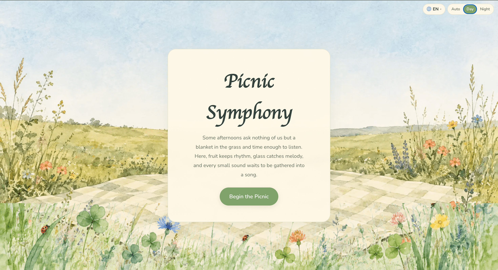
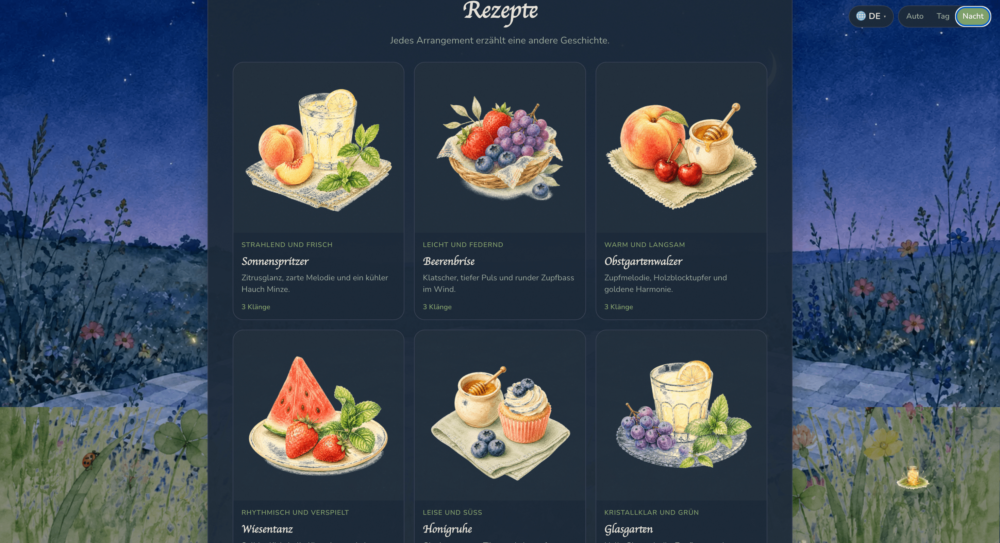
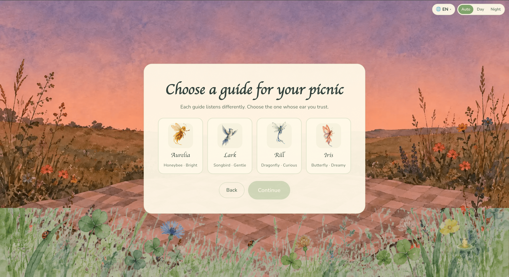

# Picnic Symphony 🧺

## About

Picnic Symphony is an interactive music-making website set at a cozy summer picnic. Select picnic ingredients to layer synchronized sound loops, follow guided recipes, and let your chosen spirit guide the scene.

## Features

- Original watercolor-style artwork (PNG, WebP)
- Twelve ingredient sounds with up to six simultaneous layers
- Procedural audio using the native Web Audio API
- Four spirit guides: Aurelia (bee), Lark (bird), Rill (dragonfly), Iris (butterfly)
- Nine guided recipes with illustrated cards
- Day, Night, Dawn, and Dusk backgrounds (Auto mode uses local time)
- Postcard composer with dynamic ingredient illustration and PNG export
- Nine languages: English, 简体中文, Español, Français, Deutsch, 日本語, हिन्दी, العربية, 한국어
- Responsive layout for desktop and mobile
- Keyboard-operable controls with visible focus states
- Prefers-reduced-motion support

## How the Sound Works

The music runs from a shared 96 BPM sequencer clock. Each ingredient owns a repeating 16-step pattern, and clicking a button toggles that layer on or off without resetting the others. All audio is generated live in the browser with oscillators, filtered noise, and short envelopes, routed through bus gains and a master compressor to keep the mix balanced.

## File Structure

```
index.html          — Main page
styles.css          — All styles
src/
  main.js           — Application entry point
  audio.js          — Audio engine and sequencer
  ingredients.js    — 12 ingredient definitions with synthesis
  recipes.js        — 9 recipe definitions
  spirits.js        — Spirit guide system
  i18n.js           — Translations (9 languages)
  i18n-recipes.js   — Recipe translations
  composition.js    — Postcard renderer
  state.js          — Application state
  router.js         — Screen navigation
  theme.js          — Day/Night/Dawn/Dusk logic
  particles.js      — Decorative particles
assets/
  ingredients/      — 12 ingredient PNGs (512×512)
  recipes/          — 9 recipe illustration PNGs
  spirits/          — Spirit guide directional assets
  backgrounds/      — 4 meadow backgrounds (WebP)
  overlays/         — Foreground grass, night lantern
  postcard/         — Picnic basket PNG
```

## Run Locally

```bash
python3 -m http.server 8000
```

Then open [http://localhost:8000](http://localhost:8000/).

All artwork and sounds are generated or included in this project. No API key or installation is required.

## Play Online
This project is hosted on GitHub Pages: [https://felicity520666.github.io/picnic-symphony/](https://felicity520666.github.io/picnic-symphony/)

## Game Screenshots


